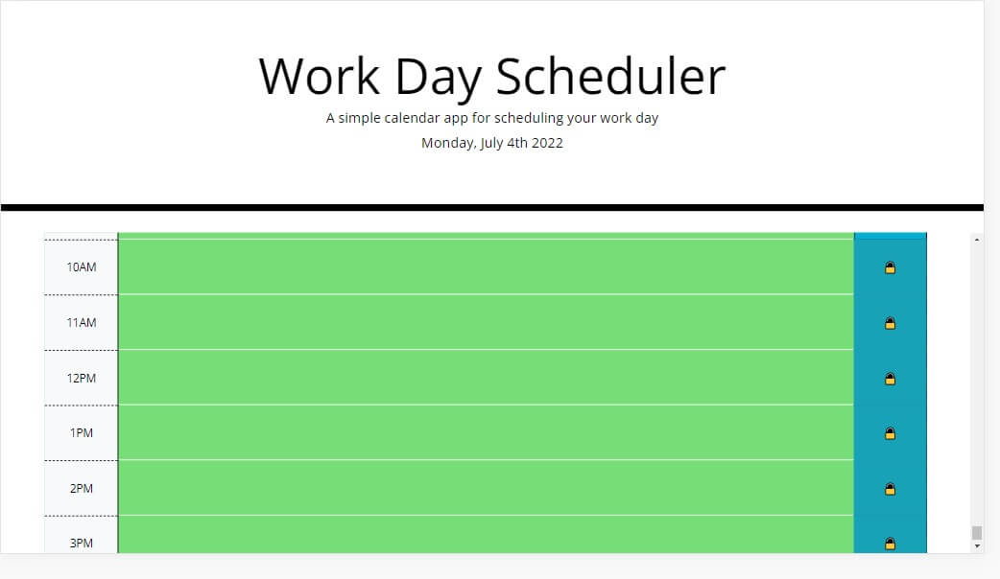

# Work Day Scheduler

## Description

This calendar app gives you the chance to organize your busy and unfulfilling life by saving events in an eye-opening format. Created with jQuery, Bootstrap, and Moment.js.

## Features

Daily planner you can add and remove events from. Timeblocks are color-coded to indicate past, future, or current events. They may also be saved to view later.

This planner also allows for scrolling up and down to other days (watch the jumbotron for the date).

## Installation

Visit [this link](https://axeljk.github.io/uw_m05_scheduler/) to view.

# Credits

* Axel Kern, creator
* W3Schools, reference for CSS and JS
* [jQuery](https://jquery.com/), for their library
* [Bootstrap](https://getbootstrap.com/), for their layouts and CSS classes
* [moment.js](https://momentjs.com/), for their library
* [Font Awesome](https://fontawesome.com/), for the lock icons
* Abbey Free, supporting me in all things